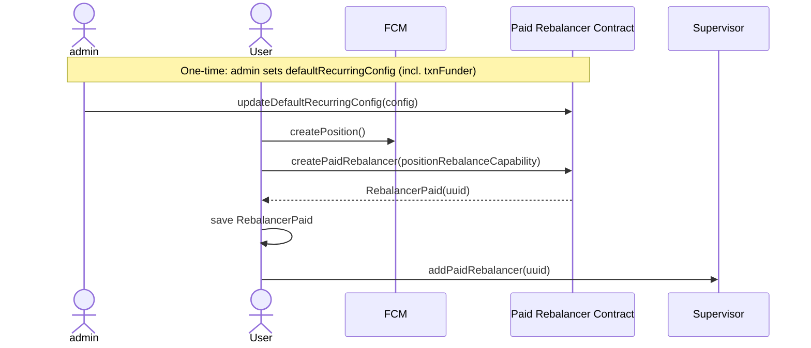
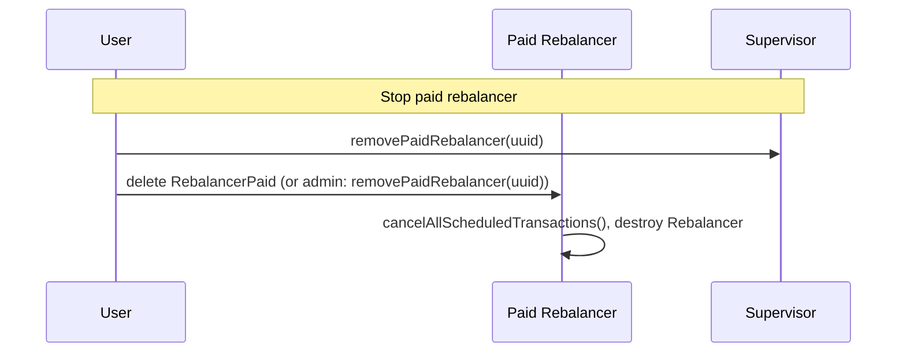
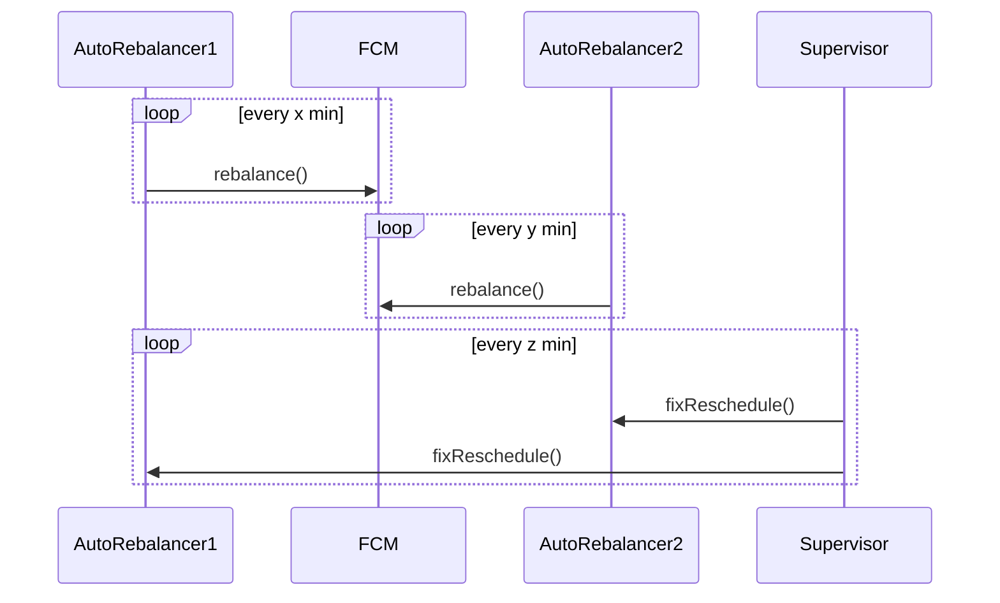

## Updated Rebalance Architecture

This system **rebalances Flow Credit Market (FCM) positions on a schedule**: at a configurable interval, a rebalancer triggers the position’s `rebalance` function. **FCM** holds positions and exposes `rebalance`. 

A **Rebalancer** when invoked, calls `rebalance` on the position and tries to schedules the next run.

A **Supervisor** runs on its own schedule (cron) and calls `fixReschedule()` on each registered rebalancer so that transient scheduling failures (e.g. temporary lack of funds) don’t leave rebalancers stuck. 

### Key Principles

* **Isolation:** FCM, Rebalancer, and Supervisor are fully independent.
* **Least Privilege:** The Rebalancer can *only* trigger the `rebalance` function.
* **Resilience:** The `fixReschedule()` call is idempotent and permissionless, ensuring the system can recover without complex auth (see below).

### Rebalancer config (RecurringConfig)

Each rebalancer is driven by a **RecurringConfig** that defines how and who pays for scheduled rebalances:

| Field | Purpose |
|-------|--------|
| **interval** | How often to run (seconds). |
| **priority** | Scheduler priority (not High). |
| **executionEffort** | Execution effort for fee estimation. |
| **estimationMargin** | Multiplier on estimated fees (feePaid = estimate × margin). |
| **forceRebalance** | Whether to force rebalance when invoked. (bool provided to the rebalance function) |
| **txnFunder** | **Who pays for rebalance transactions.** A Sink/Source (FLOW) used to pay the FlowTransactionScheduler. The rebalancer withdraws from it when scheduling the next run and refunds on cancel. |

The rebalancer uses this config to: (1) call `rebalance(force)` on the position when the scheduler fires, (2) compute the next run time from `interval`, (3) withdraw FLOW from **txnFunder** to pay the scheduler for the next scheduled transaction, and (4) on config change or cancel, refund unused fees back to **txnFunder**. So **txnFunder is the account that actually pays** for each scheduled rebalance.

### Rebalancer variants

There are two rebalancer types; they behave the same for triggering rebalances; the difference is **who supplies the config (and thus the txnFunder)** and **who can change it**.

| | **Standard Rebalancer** | **Paid Rebalancer** |
|---|---|---|
| **Who pays** | User pays (user’s txnFunder) | Admin pays (admin’s txnFunder in config) |
| **Where rebalancer lives** | In the user’s account | In the Paid contract’s account |
| **Config ownership** | User: they set RecurringConfig and can call `setRecurringConfig` | Admin/contract: `defaultRecurringConfig` for new ones; admin can `updateRecurringConfig(uuid, …)` per rebalancer |
| **User’s control** | Full: config, fixReschedule, withdraw/destroy | Only: fixReschedule by UUID, or delete their RebalancerPaid (stops and removes the rebalancer) |
| **Use case** | User wants full autonomy and to pay their own fees | Admin retains autonomy and pays fees for users (us only) |

**Note:** The Supervisor and the Paid Rebalancer are only intended for use by us; the Standard Rebalancer is for users who self-custody. The bundled `FlowALPSupervisorV1` only tracks **paid** rebalancers (`addPaidRebalancer` / `removePaidRebalancer`). For standard rebalancers, users can call `fixReschedule()` themselves when needed.

### Why calls `fixReschedule()` are necessary

After each rebalance run, the rebalancer calls `scheduleNextRebalance()` to book the next run with the FlowTransactionScheduler. That call can **fail** for transient reasons (e.g. `INSUFFICIENT_FEES_AVAILABLE`, scheduler busy, or the txnFunder reverting). When it fails, the rebalancer emits `FailedRecurringSchedule` and does **not** schedule the next execution — so the rebalancer is left with **no upcoming scheduled transaction** and would never run again unless something reschedules it.

`fixReschedule()` is **idempotent**: if there is no scheduled transaction, it tries to schedule the next one (and may emit `FailedRecurringSchedule` again if it still fails); if there is already a scheduled transaction, it does nothing.

The supervisor runs on a fixed schedule (cron) and, for each registered rebalancer, calls `fixReschedule()`. So even when a rebalancer failed to schedule its next run (e.g. temporary lack of funds), a later supervisor tick can **recover** it without the user having to do anything. The supervisor therefore provides **resilience against transient scheduling failures** and keeps rebalancers from getting stuck permanently.

### Creating a position (paid rebalancer)

User creates a position, then creates a **paid** rebalancer (which lives in the contract) and registers it with the supervisor so the supervisor can call `fixReschedule()` on it.

### Stopping the rebalance

### While running

