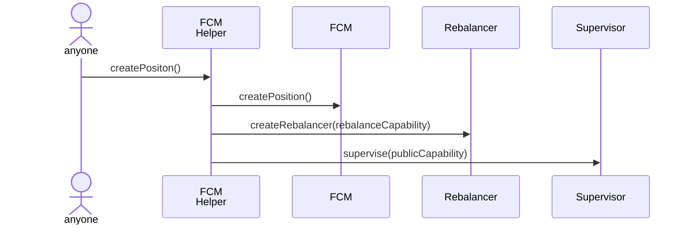
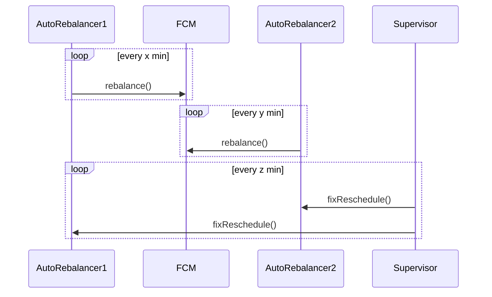

## Updated Rebalance Architecture

The core philosophy is **decoupling**: each component operates independently with the least privilege necessary.

The **Supervisor** is currently in the design phase (not yet implemented).

### Key Principles

* **Isolation:** FCM, Rebalancer, and Supervisor are fully independent.
* **Least Privilege:** The Rebalancer can *only* trigger the `rebalance` function.
* **Resilience:** The `fixReschedule()` call is idempotent and permissionless, ensuring the system can recover without complex auth.

### creating a position

### while running

