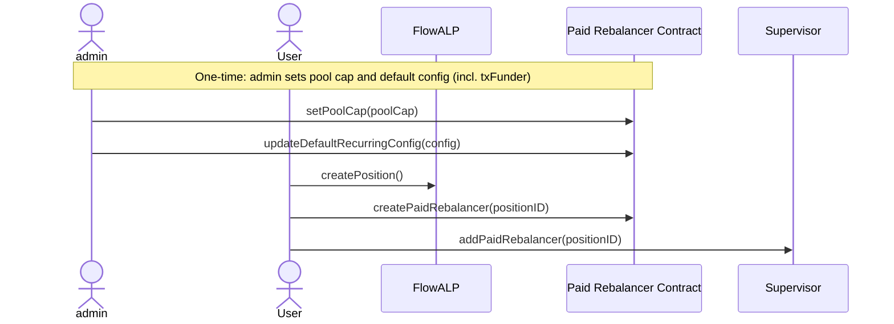
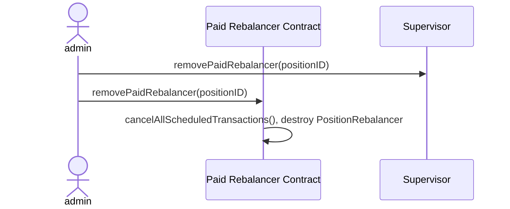
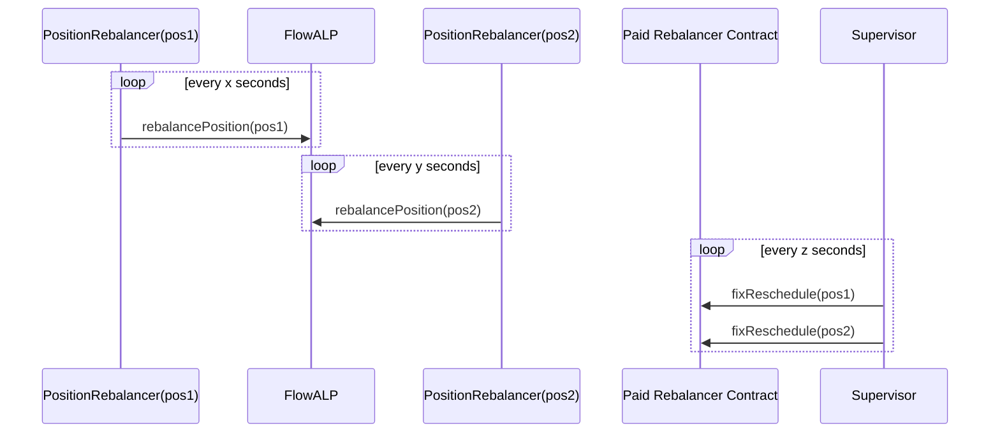

## Rebalance Architecture

This system **rebalances FlowALP positions on a schedule**: at a configurable interval, a rebalancer triggers `rebalancePosition` on the pool. **FlowALP** holds positions and exposes `rebalancePosition`.

**Implementation note:** In the current implementation, the FlowALP pool is `FlowALPv0.Pool`.

A **PositionRebalancer** when invoked, calls `rebalancePosition` on the pool and tries to schedule the next run.

A **Supervisor** runs on its own schedule (cron) and calls `fixReschedule()` on each registered rebalancer so that transient scheduling failures (e.g. temporary lack of funds) don't leave rebalancers stuck.

### Key Principles

* **Isolation:** FlowALP, the Paid Rebalancer contract, and Supervisor are fully independent.
* **Least Privilege:** The rebalancer can *only* trigger `rebalancePosition` on the pool.
* **Resilience:** `fixReschedule()` is idempotent and permissionless — the system recovers without complex auth.

### Rebalancer config (RecurringConfig)

Each rebalancer is driven by a **RecurringConfig** set by the admin:

| Field | Purpose |
|-------|--------|
| **interval** | How often to run (seconds). |
| **priority** | Scheduler priority (not High). |
| **executionEffort** | Execution effort for fee estimation. |
| **estimationMargin** | Multiplier on estimated fees (feePaid = estimate × margin). |
| **forceRebalance** | Whether to force rebalance regardless of current health. |
| **txFunder** | **Who pays for rebalance transactions.** A Sink/Source (FLOW) used to pay the FlowTransactionScheduler. The rebalancer withdraws from it when scheduling the next run and refunds on cancel. |

The rebalancer uses this config to: (1) call `rebalancePosition(pid, force)` on the pool when the scheduler fires, (2) compute the next run time from `interval`, (3) withdraw FLOW from **txFunder** to pay the scheduler for the next scheduled transaction, and (4) on config change or cancel, refund unused fees back to **txFunder**. **txFunder is the account that actually pays** for each scheduled rebalance — controlled by the admin.

### How it works

`FlowALPRebalancerPaidv1` is a **managed service**: the admin sets a default `RecurringConfig` (including a `txFunder`) and a pool capability. Anyone can call `createPaidRebalancer(positionID)` to enroll a position — no capability required from the caller. The contract:

1. Creates a `PositionRebalancer` resource stored in the contract account.
2. Issues a self-capability so the scheduler can call back into it.
3. Schedules the first run using the default config.

Two safeguards prevent the permissionless creation from being abused:
1. Only one rebalancer per positionID (contract enforces this).
2. FlowALP enforces a minimum economic value per position.

The admin can remove a rebalancer via `removePaidRebalancer` (cancels scheduled transactions and refunds fees to txFunder). The `defaultRecurringConfig` applies to all rebalancers and can be updated by the admin at any time via `updateDefaultRecurringConfig`.

### Creating a position

```mermaid
sequenceDiagram
    actor admin
    actor User
    participant FlowALP
    participant Paid as Paid Rebalancer Contract
    participant Supervisor
    Note over admin,Paid: One-time: admin sets pool cap and default config (incl. txFunder)
    admin->>Paid: setPoolCap(poolCap)
    admin->>Paid: updateDefaultRecurringConfig(config)
    User->>FlowALP: createPosition()
    User->>Paid: createPaidRebalancer(positionID)
    User->>Supervisor: addPaidRebalancer(positionID)
```

### Stopping the rebalancer

```mermaid
sequenceDiagram
    actor admin
    participant Paid as Paid Rebalancer Contract
    participant Supervisor
    admin->>Supervisor: removePaidRebalancer(positionID)
    admin->>Paid: removePaidRebalancer(positionID)
    Paid->>Paid: cancelAllScheduledTransactions(), destroy PositionRebalancer
```

### While running

```mermaid
sequenceDiagram
    participant R1 as PositionRebalancer(pos1)
    participant FlowALP
    participant R2 as PositionRebalancer(pos2)
    participant Paid as Paid Rebalancer Contract
    participant SUP as Supervisor
    loop every x seconds
    R1->>FlowALP: rebalancePosition(pos1)
    end
    loop every y seconds
    R2->>FlowALP: rebalancePosition(pos2)
    end
    loop every z seconds
    SUP->>Paid: fixReschedule(pos1)
    SUP->>Paid: fixReschedule(pos2)
    end
```

### Why `fixReschedule()` is necessary

After each run, the rebalancer calls `scheduleNext()` to book the next run with `FlowTransactionScheduler`. That call can **fail** for transient reasons (e.g. `txFunder` has insufficient balance, or the scheduler is busy). When it fails, the rebalancer emits `FailedRecurringSchedule` and does **not** schedule the next execution — leaving it stuck.

`fixReschedule()` is **idempotent**: if there is no scheduled transaction, it tries to schedule the next one; if one already exists, it does nothing. The Supervisor calls this for each registered rebalancer on every tick, recovering from transient failures automatically.
